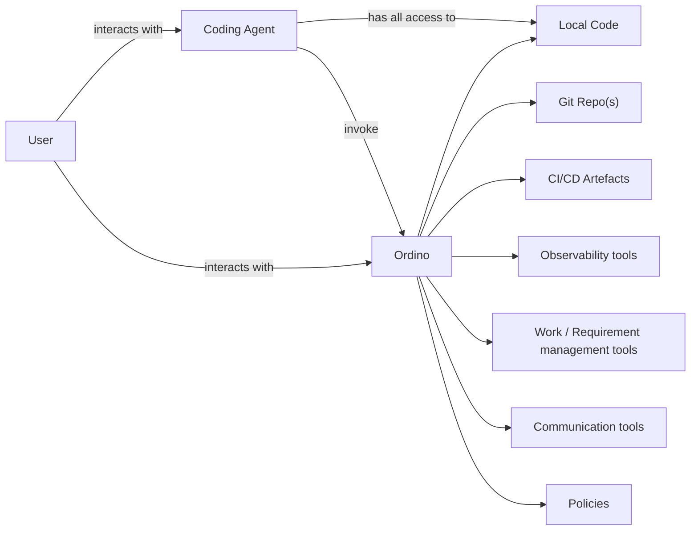

# Ordino User Stories

Ordino is positioned as **the trust layer that lets developers release faster with high confidence**. These stories describe the product's capabilities, grouped by theme.

**Personas**
- **Developer** — writes code, opens/reviews PRs, works day-to-day in the IDE.
- **Lead** — tech lead or eng manager; owns project quality and merge policy for a team.
- **Release owner** — whoever is on the hook for what actually ships and what happens after.
- **New member** — joining a project/workspace for the first time.

## Target architecture

The coding agent gets deep, narrow access to one thing — the local code it's actively writing. Ordino gets broad, shallow access across the whole SDLC, because its job is correlating signal *across* systems, not authoring code itself. That asymmetry is why repo access is granted explicitly and scopeably (§1) rather than inherited from the agent.

Each node the diagram fans out to maps to stories below:

| Diagram node | Stories |
|---|---|
| Local Code / Git Repo(s) | §1, §2, §6, §7 |
| CI/CD Artefacts | §5 |
| Observability tools | §10, §11 |
| Work / Requirement management tools | §16 |
| Communication tools | §17 |
| Policies | §4, §14 |
| Coding Agent → Ordino (invoke) | §18 |

§16–18 are things the diagram implies that weren't backed by any story until this update — Jira/Linear/Slack already exist as connectable integrations in the prototype (`lib/mock-data/integrations.ts`) but nothing uses them, and today's agent↔Ordino handoff is human-mediated (`fix-prompt-card.tsx`), not the direct invoke this diagram targets.

---

## 1. Granting & scoping repo access
*Where this lives: `components/integrations/connect-dialog.tsx`, `lib/mock-data/github-repos.ts`*

- As a **lead**, I want to grant Ordino access to specific repos in our GitHub org — not an all-or-nothing connection — so that I control exactly what Ordino can see and act on.
- As a **lead**, I want to disconnect GitHub and have Ordino's repo access revoked immediately, so that I can pull back access without deleting other integrations.
- As a **developer**, I want to see which repos Ordino currently has access to at a glance, so that its cross-repo claims are backed by visible, real scope rather than assumed.

## 2. Pre-merge PR verification
*Where this lives: `components/prs/verdict-banner.tsx`, `flow-check-list.tsx`, `flow-check-item.tsx`, `pr-header.tsx`*

- As a **developer**, I want Ordino to check my PR against the user flows it could affect, so that I catch regressions before a human reviewer has to.
- As a **developer**, I want a single clear verdict — "safe to merge" or "regression found" — on every PR, so that I don't have to read every flow check to know if something's wrong.
- As a **developer**, I want to see exactly which step of a flow failed and why, so that I can act on the finding without re-deriving the failure myself.
- As a **developer**, I want to mark a flagged flow as "not a regression" when Ordino gets it wrong, so that a false positive doesn't block me.
- As a **developer**, I want a pre-written fix prompt I can copy straight to my coding agent when Ordino finds a bug, so that I don't have to translate its findings into a task myself.
- As a **lead**, I want PRs that were verified *before* they were even opened to be marked "pre-verified," so that reviewers can tell which PRs already cleared Ordino's checks.

## 3. Agent trust & track record
*Where this lives: `components/prs/agent-trust-panel.tsx`, `getAgentTrackRecords()`*

- As a **lead**, I want to see each coding agent's history — PRs verified, regressions caught, clean ratio — so that I know which agents I can trust with less oversight.
- As a **lead**, I want that trust record built from actual outcomes, not a self-reported score, so that it reflects reality even as agents change.
- As a **developer**, I want to see a project's overall track record (PRs verified, regressions caught, flags overturned), so that I can gauge how much Ordino's verdicts are actually catching.

## 4. Merge policy
*Where this lives today: `components/prs/merge-policy-toggle.tsx`*

- As a **lead**, I want to require Ordino verification before agent-authored PRs can merge, so that unverified changes can't slip through.
- As a **lead**, I want that requirement to actually block the merge — not just display a warning — so that the policy has teeth instead of being advisory copy.
- As a **developer**, I want a one-click override for a blocked merge, with the override logged and visible to my lead, so that I'm not stuck when Ordino is wrong but the team still has an audit trail.

## 5. Quality visibility
*Where this lives: `components/quality/quality-dashboard.tsx`, `lib/mock-data/quality.ts`*

- As a **lead**, I want to see overall test coverage, build success rate, and flaky test rate for a project at a glance, so that I can spot a quality trend before it becomes a problem.
- As a **lead**, I want coverage broken down by test type (unit / integration / front-end) and trended over time, so that I know where the gaps actually are.
- As a **developer**, I want to see recent test suite runs with pass/fail counts and flaky-test notes, so that I can tell a real failure from noise.

## 6. Test generation & coverage gap-filling
*Where this lives: `lib/ide/test-automation-fixture.ts`, `components/ide/ordino-panel.tsx`*

- As a **developer**, I want Ordino to check test coverage for the code I just changed — not just run the existing suite — so that I find gaps before a reviewer or a bug report does.
- As a **developer**, I want Ordino to call out which specific untested path matters most (e.g. "no case for a promo code combined with tax," the exact path I just touched), so that the coverage report is actionable, not just a percentage.
- As a **developer**, I want Ordino to generate the missing tests across the right layers — unit, component, and end-to-end — and run them locally, so that closing a coverage gap doesn't mean writing three kinds of tests by hand.
- As a **developer**, I want the generated tests presented for my review with a ready commit message before anything is committed, so that I stay in control of what ships.

## 7. Cross-repo dependency awareness
*Where this lives: `lib/ide/impact-analysis-fixture.ts`, `components/ide/ordino-panel.tsx`*

- As a **developer**, I want Ordino to proactively tell me when a change I made isn't fully handled by the other repos that depend on it, so that I find out before a downstream team does.
- As a **developer**, I want that warning to visibly stand out from Ordino's normal replies, so that I can tell "Ordino noticed this on its own" from "Ordino answered what I asked."
- As a **developer**, I want Ordino to offer to write the missing tests in the *other* repos once it flags a cross-repo gap, so that closing it doesn't require switching tools or context.

## 8. Conversational assistant
*Where this lives: `components/chat/*`, `lib/agent-router.ts`*

- As a **developer**, I want to ask Ordino about a bug or codebase question and get routed to the right specialist automatically, so that I don't have to know which agent handles what.
- As a **developer**, I want my conversation history kept per project, so that I can pick up a prior investigation without re-explaining it.

## 9. Team & workspace
*Where this lives: `lib/store/index.ts` (teamMembers, inviteMember)*

- As a **lead**, I want to invite a teammate to a workspace with a specific role (owner/admin/member), so that access matches responsibility.
- As a **new member**, I want an invite to show as pending until I join, so that it's clear who's active versus still onboarding.

## 10. Post-deploy regression watch
- As a **release owner**, I want Ordino to watch error rate, latency, and crash rate after a release ships, so that I know within minutes — not days — if it caused a regression.
- As a **developer**, I want a post-deploy regression flagged unprompted, tied back to the specific PR that likely caused it, so that I don't have to correlate dashboards and deploy logs myself.
- As a **lead**, I want post-deploy findings to feed back into that PR's and agent's track record, so that trust reflects production outcomes, not just pre-merge checks.

## 11. Incident-to-commit triage
- As a **release owner**, when an alert fires, I want Ordino to use its cross-repo dependency graph to suggest which recent change across our repos likely caused it, so that I cut triage time from hours to minutes.
- As a **developer**, I want that suggestion ranked by confidence with its reasoning shown, so that I can verify it instead of blindly trusting it.

## 12. Flaky test quarantine
- As a **developer**, I want Ordino to detect a test that's flaky (not just failing) and quarantine it automatically, so that a real regression doesn't get lost in noise and I'm not blocked by a non-deterministic failure.
- As a **lead**, I want a quarantined test to open a tracked task to fix it, so that quarantine doesn't become a permanent hiding place for broken tests.

## 13. Security & dependency scanning in the verdict
- As a **lead**, I want "safe to merge" to also account for known CVEs and leaked secrets, not just broken user flows, so that a clean functional verdict doesn't hide a security risk.
- As a **developer**, I want a security finding to show up as its own flow-check-style item with a clear fix path, so that I handle it the same way I already handle a functional regression.

## 14. Policy learning from overturns
- As a **developer**, I want Ordino to stop re-flagging a pattern I've repeatedly marked "not a regression," so that I don't lose trust in the gate from alert fatigue.
- As a **lead**, I want to review what Ordino has learned to ignore, so that I can catch it if it's learned to ignore something it shouldn't.

## 15. Release notes & org-level reporting
- As a **release owner**, I want an auto-generated summary of what changed and what was verified for a release, so that I have a trustworthy artifact to share without reading every diff.
- As a **lead** managing multiple projects, I want an org-level rollup of agent trust and quality trends, so that I can see which teams/agents need attention without visiting each project individually.

## 16. Work & requirement context (Jira, Linear)
*Jira and Linear already exist as connectable integrations (`lib/mock-data/integrations.ts`) but nothing uses them yet — this closes that gap.*

- As a **developer**, I want Ordino to check my PR against the acceptance criteria on its linked Jira/Linear ticket, so that "safe to merge" also means "actually did what was asked."
- As a **lead**, I want Ordino to flag a PR that doesn't reference any ticket, so that work stays traceable without me policing it manually.
- As a **developer**, I want Ordino to pull context from a linked ticket into its own investigation in chat or the IDE panel, so that I don't have to paste requirements in myself.

## 17. Communication & notifications (Slack)
*Slack already exists as a connectable integration (`lib/mock-data/integrations.ts`) but nothing uses it yet — this closes that gap.*

- As a **lead**, I want Ordino to post to a Slack channel when it catches a regression or a cross-repo gap, so that the team finds out where they already look, not just inside Ordino.
- As a **developer**, I want to act on an Ordino Slack notification — dismiss a flag, ask a follow-up — without switching to the app, so that responding to a finding doesn't cost a context switch.

## 18. Direct agent invocation
*Today's fix handoff is human-mediated (`fix-prompt-card.tsx`) — the developer copies a prompt from Ordino and pastes it to their coding agent. The target architecture has the coding agent calling Ordino directly.*

- As a **developer**, I want my coding agent to invoke Ordino automatically as part of its own workflow — before opening a PR — so that verification happens without me manually relaying prompts back and forth.
- As a **lead**, I want that automatic invocation to be what actually produces the "pre-verified" badge on a PR, so that pre-verification reflects a real, enforced step in the agent's workflow, not just a label.
